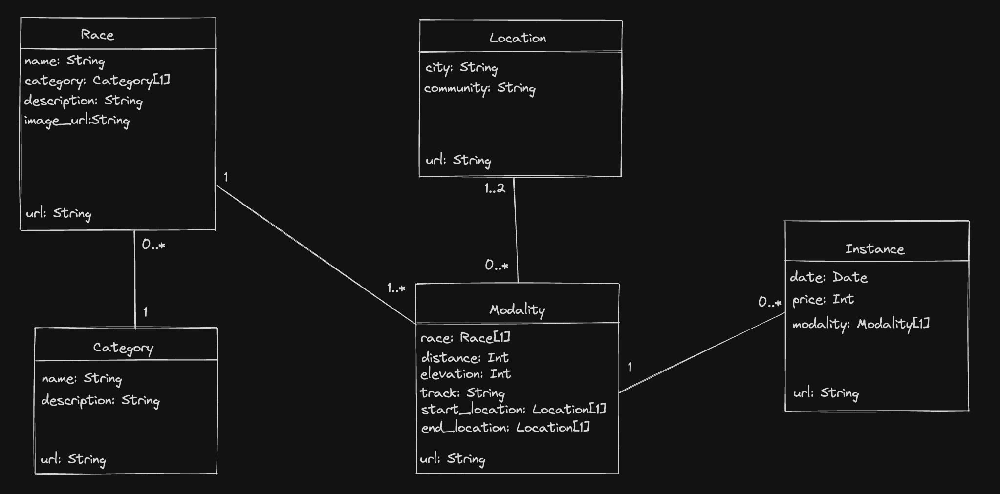

# spanish-foot-races
This is a NodeJS + Express + MongoDB App to have a repository of the main Asphalt, Trail and OCR Races in Spain.

## Model

## Security
Session auth is used to protect update and delete ops. Password is saved in a .env variable